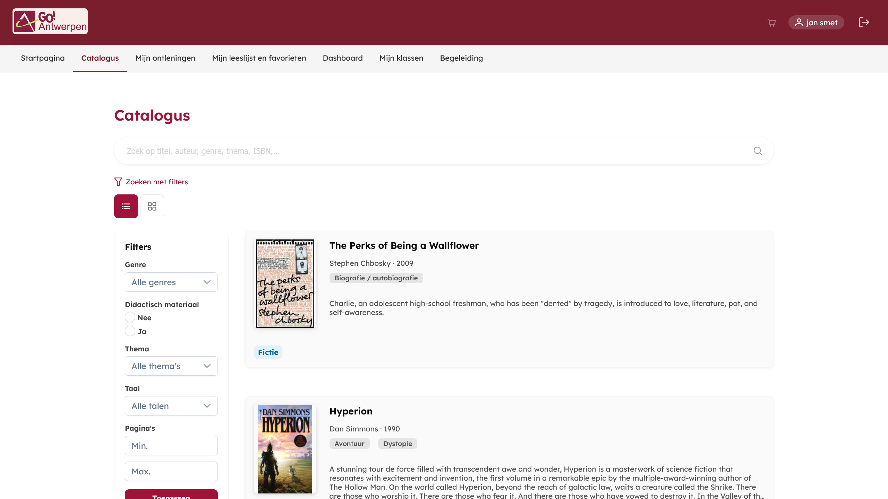
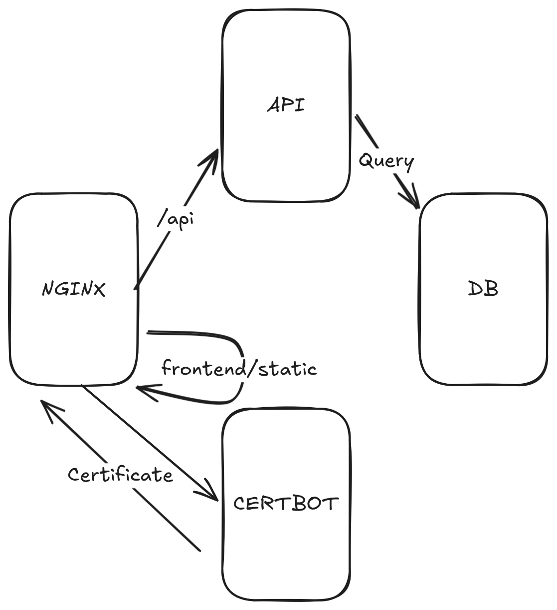

# Slimme Bibliotheek (GO! Scholengroep Antwerpen)




GoSmartLib is een bibliotheekbeheerapplicatie voor scholen. Leerlingen en leerkrachten kunnen boeken opzoeken en uitlenen. 
Beheerders kunnen de collectie beheren en uitleningen opvolgen. Aanmelden gebeurt via Smartschool.

<!-- TODO ## Functionaliteiten
-  -->

## Opstarten van applicatie

### Omgevingsvariabelen

Deze waarden zijn vereist om aan te maken in de 'Omgevings variabelen/Syteem variabelen' (windows).

Omgevingsvariabelen worden bewust buiten de code gehouden om deze redenen:
- Beveiliging: wachtwoorden en API-sleutels komen niet in je broncode terecht.
- Flexibiliteit: zelfde code, andere instellingen per omgeving (lokaal, test, productie).


**ADMIN_PASSWORD**: Wachtwoord voor de beheerdersaccount (kan op het platform worden veranderd). <br>Waarde: zelf te kiezen

**BOOKS_KEY**: API-sleutel voor Google Books. <br>Waarde: [API sleutel aanmaken](https://developers.google.com/books/docs/v1/using#APIKey)

**CLIENT_ID**: Client-ID voor OAuth2-authenticatie via Smartschool. <br>Waarde: zelf te [verkrijgen](https://www.smartschool.be/oauth/).

**CLIENT_SECRET**: Geheime sleutel voor OAuth2-authenticatie via Smartschool. <br>Waarde: zelf te [verkrijgen](https://www.smartschool.be/oauth/). 

**COOKIE_SECURE**: Geeft aan of cookies enkel over HTTPS verstuurd mogen worden. false betekent dat HTTP ook toegestaan is (voor lokale ontwikkeling). <br>Waarde: `false`

**DB_UPDATE**: Geeft aan hoe JPA de database bijwerkt bij het opstarten. update betekent dat de tabellen automatisch bijgewerkt worden zonder data te verliezen. <br>Waarde: `update`

**DB_URL**: De verbindingsstring naar de MySQL-database, hier lokaal op poort 3306, database gosmartlib. <br>Waarde: `jdbc:mysql://localhost:3306/gosmartlib`

**ENCRYPTION_KEY**: Sleutel voor het versleutelen van gevoelige gegevens.  <br>Waarde: zelf te kiezen

**MYSQL_DATABASE**: Naam van de MySQL-database. <br>Waarde: `gosmartlib`

**MYSQL_USER**: Gebruikersnaam voor de MySQL-database. <br>Waarde: `root`

**MYSQL_PASSWORD**: Wachtwoord voor de MySQL-database. <br>Waarde: `root`

**UPLOAD_DIR**: Map waar geüploade bestanden en omslagafbeeldingen opgeslagen worden, en door Nginx teruggestuurd worden naar de client. <br>Waarde: zelf te kiezen

### Frontend

1. Navigeer naar de frontend map:
```bash
   cd frontend
```

2. Installeer de frontend libraries:
```bash
   npm install
```

3. Start de applicatie:
```bash
   npm start
```

4. Open de applicatie in je browser op `http://localhost:4200`


### Database

Installeer [Mysql](https://dev.mysql.com/downloads/installer/) en start de service op.

1. Open de MySQL-opdrachtprompt:
```bash
   mysql -u root -p
```

2. Maak de database aan:
```sql
   CREATE DATABASE gosmartlib;
```

3. Verlaat de MySQL-opdrachtprompt:
```sql
   EXIT;
```


### Backend

1. Navigeer naar de backend map:
```bash
   cd backend
```

2. Bouw de applicatie:
```bash
   .\mvnw clean install
```

3. Start de applicatie:
```bash
   .\mvnw spring-boot:run
```

4. De applicatie draait op `http://localhost:8080`


### Nginx

Nginx wordt lokaal gebruikt voor het laden van de boekomslagen en het lesmateriaal dat leerkrachten kunnen downloaden. Nginx kan via wsl opgestart worden met de `default.conf` (aanwezig in de assets folder) en de UPLOAD_DIR waarde ingevuld bij de `alias`.


## Ontwikkeling van de applicatie

De applicatie wordt ontwikkeld in een monorepo, wat betekent dat de frontend en backend zich in dezelfde Git-repository bevinden.

### Codestijlen

#### Code en commentaar
- Code wordt in het engels geschreven.
- Commentaar wordt in het engels geschreven.

#### Java
- **Naamgeving**: camelCase voor variabelen en methoden, PascalCase voor klassen
- **Inspringing**: 4 spaties
- **Testen**: methoden worden benoemd als `WhenThis_DoSomething_WhenCondition`

#### TypeScript
- **Naamgeving**: camelCase voor variabelen en methoden, PascalCase voor klassen, snake_case voor modellen (bv. `user_role`)
- **Inspringing**: 2 spaties

#### HTML / CSS
- **Inspringing**: 2 spaties

#### Git naamgevingsconventies
- **Branches**: `feature-<nummer>-<korte-beschrijving>` (in het Nederlands, bv. `feature-42-gebruikersbeheer`)
- **Commits**: in het Engels (bv. `Add user authentication`)


### Architectuur



De applicatie bestaat uit de volgende onderdelen:

- **NGINX**: de webserver die als omgekeerde proxy fungeert. API-verzoeken (`/api`) worden doorgestuurd naar de backend, statische bestanden van de frontend worden rechtstreeks teruggestuurd.
- **API**: de Spring Boot backend die verzoeken verwerkt.
- **DB**: de MySQL-database die door de API bevraagd wordt.
- **Certbot**: beheert het SSL-certificaat en stelt dit ter beschikking aan NGINX voor beveiligde HTTPS-verbindingen.

### Technologieën & Versies

- Backend taal: Java 21
- Backend framework: Spring boot 3.5.10
- Frontend: Angular 20.3.2
- Frontend componenten library: [Primeng](https://primeng.org/) 21.1.1
- Database: MySQL 9.6.0
- Containerorchestratie: Docker

## Vermelding
*Dit project is ontwikkeld in opdracht van GO! Scholengroep Antwerpen.*